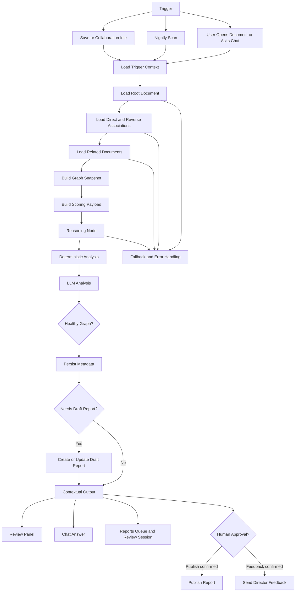

# FleetGraph

## Agent Responsibility

FleetGraph is responsible for proactively reviewing the execution readiness of connected Ship work and surfacing problems before a PM or engineer has to go looking for them.

It runs in two modes through the same core graph:

- Proactive:
  - document save
  - collaboration-idle after live editing settles
  - nightly workspace scan
- On-demand:
  - contextual review from the current document view
  - contextual chat scoped to the current document and its nearby graph

### What FleetGraph monitors proactively

- project graphs that score `yellow` or `red`
- issues and work items that are not ready to execute
- thin or placeholder documents
- missing owner or assignee metadata
- missing acceptance criteria or implementation detail
- linked work where blockers or weak documents affect nearby documents
- review or retro documents with observations but no clear follow-up actions

### What FleetGraph reasons about on demand

- whether the current document is ready to execute
- what the highest-risk document in the local graph is
- what should be fixed first
- whether the graph is fully reviewed or bounded by traversal limits
- what a PM should do next based on the current view

### What FleetGraph can do autonomously

- fetch Ship documents and graph relationships through REST
- traverse `parent_id`, `belongs_to`, direct associations, and reverse associations
- build a bounded local graph around the current root document
- score readiness and quality
- persist FleetGraph metadata back into document `properties`
- create or update draft quality reports
- generate draft director response options

### What always requires human approval

- publishing a FleetGraph quality report
- sending director feedback

### Who it notifies, and when

For early submission, FleetGraph notifies users through Ship-native review surfaces instead of external messaging:

- document review panel when a document is reviewed on demand
- contextual chat when the user asks a question in the current document view
- FleetGraph reports queue when a draft report exists
- FleetGraph batch review session when multiple findings exist

### How it knows who is on a project and what their role is

FleetGraph uses:

- the root document and nearby graph relationships
- document metadata such as `owner_id`, `assignee_id`, and `assignee_ids`
- the current viewer's Ship session and workspace role when invoked on demand

### How on-demand mode uses current-view context

The current document becomes the root of the graph run. FleetGraph fetches the root plus nearby linked documents, scores that local graph, and answers questions based on that scoped context rather than the whole workspace.

## Graph Diagram

## Use Cases

| # | Role | Trigger | Agent Detects / Produces | Human Decides |
| --- | --- | --- | --- | --- |
| 1 | PM | Project save | Project health summary, top blockers, and a draft quality report | Whether to publish the report and what to fix first |
| 2 | PM | Nightly scan on project roots | Non-green projects that still need attention even without a new save | Which unhealthy projects to review first |
| 3 | Engineer | Issue save or document-scoped review | Missing acceptance criteria, weak implementation detail, thin content, or missing ownership | Whether to tighten the issue before continuing execution |
| 4 | PM | On-demand question from the current document view | Highest-risk item in the current local graph and a concrete next action | Whether to re-scope, reassign, escalate, or fix content first |
| 5 | PM | Multiple FleetGraph findings exist | Batch review session grouped by severity and report state | Which draft reports to publish now and which findings can wait |

## Trigger Model

FleetGraph uses a hybrid trigger model:

- save-triggered and collaboration-idle runs for low-latency proactive detection
- nightly scan for safety-net coverage of stale or unchanged unhealthy projects

### Why this model

Poll-only was rejected because it weakens responsiveness and makes it harder to hit the `< 5 minute` detection requirement.

Save-only was rejected because some important conditions stay true without a new edit. A project can remain unhealthy even if nobody touches it today.

The hybrid model gives:

- fast response after meaningful document changes
- coverage for stale or unchanged unhealthy graphs
- a defensible cost profile because runs are deduped and traversal is bounded

### Cost, reliability, and latency tradeoffs

- Cost:
  - controlled by content-hash dedupe, queue coalescing, depth limits, and document limits
- Reliability:
  - durable DB-backed queue is safer than only relying on in-memory timers
- Latency:
  - queued immediately on trigger, then flushed on a short interval

## Test Cases

| # | Ship State | Expected Output | Trace Link |
| --- | --- | --- | --- |
| 1 | A project is saved with linked issues or docs that are weak, blocked, or under-specified | FleetGraph scores the graph, persists quality metadata, and creates or updates a draft report when needed | Use existing save-trigger trace |
| 2 | A collaboratively edited document goes idle after content changes | FleetGraph queues one idle-triggered run, rescans the local graph, and updates quality metadata | Use existing collaboration-idle trace |
| 3 | A nightly scan runs over project roots and finds a non-green project | FleetGraph persists project health and optionally creates a draft report for a non-green root without an existing report | Use existing nightly-scan trace |
| 4 | A PM opens a document and asks what to fix first | FleetGraph uses the current document as root and returns the top risk plus the next recommended action | Use existing on-demand trace if captured, otherwise capture one from the document chat path |
| 5 | A draft FleetGraph report exists and a PM reviews it | FleetGraph shows the saved artifact and pauses before publish until the PM confirms | Use existing publish-gate trace or capture one from report detail flow |

## Architecture Decisions

### Framework Choice

FleetGraph is implemented as a graph-shaped runtime inside the Ship API rather than as a separate standalone agent service. The node structure is explicit in the FleetGraph service layer and is traced in LangSmith.

Why this choice:

- it keeps FleetGraph close to Ship's real REST data source
- it lets proactive runs, on-demand review, chat, and nightly scan share the same runtime
- it reduced integration risk during the sprint

Tradeoff:

- there is no separate visual graph DSL driving execution
- we compensate with explicit node definitions, branching logic, and LangSmith tracing

### Node Design Rationale

FleetGraph is split into:

- context nodes:
  - normalize trigger source, root document, and viewer context
- fetch nodes:
  - fetch the root document
  - fetch direct and reverse associations in parallel
  - fetch nearby related documents
- reasoning nodes:
  - deterministic scoring first
  - LLM refinement second when configured
- action nodes:
  - persist metadata
  - create or update draft reports
  - publish report only after human approval
  - send director feedback only after human approval
- output nodes:
  - review panel
  - chat
  - reports queue
  - review session

### State Management Approach

Within a run, FleetGraph carries:

- root document id
- trigger source
- expanded documents and associations
- graph depth and truncation metadata
- document-level analysis
- executive summary
- remediation suggestions

Between runs, FleetGraph persists:

- quality metadata on documents
- `quality_report_id` links
- queued trigger jobs in `fleetgraph_jobs`
- content hashes for dedupe

Why this approach:

- it avoids redundant reprocessing
- it makes the latest FleetGraph result visible directly in Ship
- it keeps proactive processing durable across process restarts

### Deployment Model

FleetGraph runs inside the Ship API service for normal request and queue processing. The proactive path uses a DB-backed queue for triggered jobs, and nightly scans run through the scheduled FleetGraph scan path.

Why this choice:

- one shared runtime
- one shared data access boundary through Ship REST
- easier deployment than maintaining a separate worker stack for early submission
